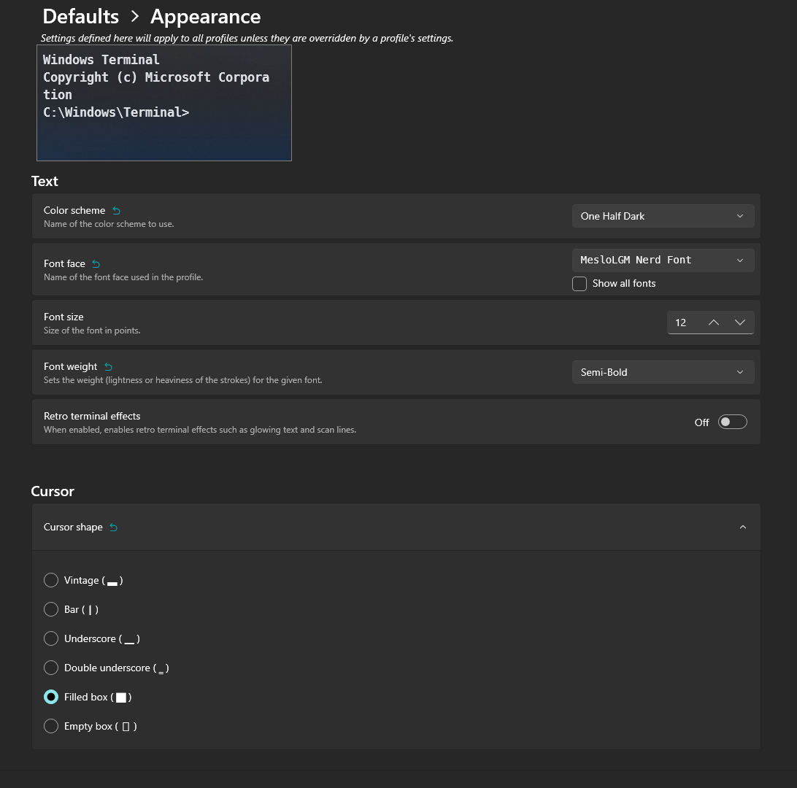
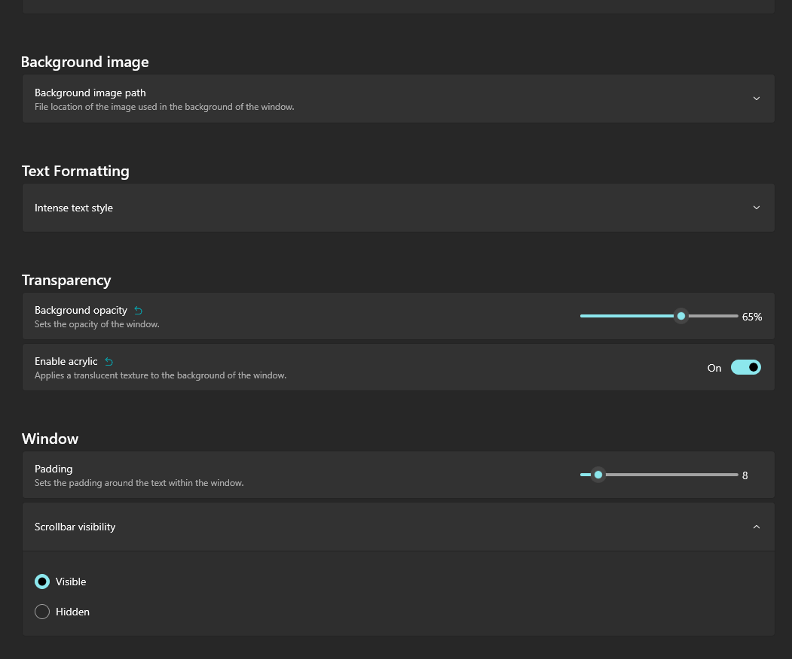
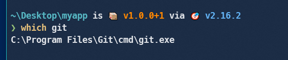
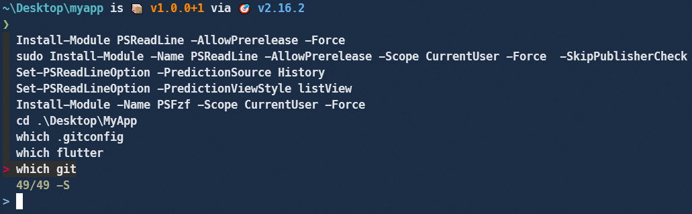
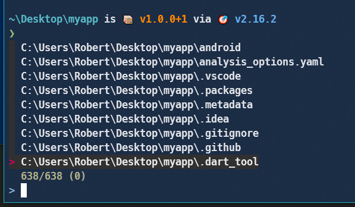
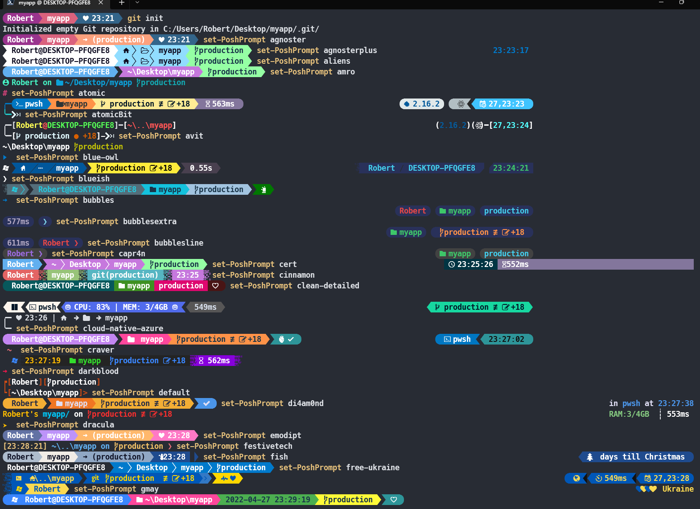

# Make the current commit the only (initial) commit in a Git repository

**Description :**   Deleting the .git folder may cause problems in your git repository. If you want to delete all your commit history but keep the code in its current state, it is very safe to do it as in the following:

**Example** :

```powershell
iwr -useb get.scoop.sh | iex
git config --global credential.helper manager-core
scoop install sudo
scoop install windows-terminal
scoop install extras/vcredist2022
scoop install starship
scoop install fzf
scoop install nuget
scoop install winget
iex "& { $(irm https://aka.ms/install-powershell.ps1) } -UseMSI"
install-Module posh-git  -Scope CurrentUser -Force
install-Module oh-my-posh -Scope CurrentUser -Force
sudo Install-Module -Name Terminal-Icons -Repository PSGallery -Force
sudo Install-Module -Name z -Force -AllowClobber
Install-Module -Name PowerShellGet -Force
sudo Install-Module -Name PSReadLine -AllowPrerelease -Scope CurrentUser -Force  -SkipPublisherCheck
Set-PSReadLineOption -PredictionSource History
Set-PSReadLineOption -PredictionViewStyle listView
Install-Module -Name PSFzf -Scope CurrentUser -Force
winget install oh-my-posh

cd ~\AppData\Local
git clone https://github.com/JanDeDobbeleer/oh-my-posh.git

```


**this will not keep your old commit history around**


**[based on a mix of answers in stackoverflow](https://stackoverflow.com/questions/9683279/make-the-current-commit-the-only-initial-commit-in-a-git-repository)**












set-PoshPrompt M365Princess
set-PoshPrompt agnoster
set-PoshPrompt agnosterplus
set-PoshPrompt aliens
set-PoshPrompt amro
set-PoshPrompt atomic
set-PoshPrompt atomicBit
set-PoshPrompt avit
set-PoshPrompt blue-owl
set-PoshPrompt blueish
set-PoshPrompt bubbles
set-PoshPrompt bubblesextra
set-PoshPrompt bubblesline
set-PoshPrompt capr4n
set-PoshPrompt cert
set-PoshPrompt cinnamon
set-PoshPrompt clean-detailed
set-PoshPrompt cloud-native-azure
set-PoshPrompt craver
set-PoshPrompt darkblood
set-PoshPrompt default
set-PoshPrompt di4am0nd
set-PoshPrompt dracula
set-PoshPrompt emodipt
set-PoshPrompt festivetech
set-PoshPrompt fish
set-PoshPrompt free-ukraine
set-PoshPrompt gmay
set-PoshPrompt grandpa-style
set-PoshPrompt half-life
set-PoshPrompt honukai
set-PoshPrompt hotstick.minimal
set-PoshPrompt hunk
set-PoshPrompt huvix
set-PoshPrompt if_tea
set-PoshPrompt iterm2
set-PoshPrompt jandedobbeleer
set-PoshPrompt jblab_2021
set-PoshPrompt jonnychipz
set-PoshPrompt jtracey93
set-PoshPrompt jv_sitecorian
set-PoshPrompt kali
set-PoshPrompt lambda
set-PoshPrompt lambdageneration
set-PoshPrompt larserikfinholt
set-PoshPrompt M365Princess
set-PoshPrompt marcduiker
set-PoshPrompt markbull
set-PoshPrompt material
set-PoshPrompt microverse-power
set-PoshPrompt mojada
set-PoshPrompt montys
set-PoshPrompt mt
set-PoshPrompt negligible
set-PoshPrompt night-owl
set-PoshPrompt nordtron
set-PoshPrompt nu4a
set-PoshPrompt paradox
set-PoshPrompt pararussel
set-PoshPrompt patriksvensson
set-PoshPrompt peru
set-PoshPrompt pixelrobots
set-PoshPrompt plague
set-PoshPrompt powerlevel10k_classic
set-PoshPrompt powerlevel10k_lean
set-PoshPrompt powerlevel10k_modern
set-PoshPrompt powerlevel10k_rainbow
set-PoshPrompt powerline
set-PoshPrompt probua.minimal
set-PoshPrompt pure
set-PoshPrompt remk
set-PoshPrompt robbyrussel
set-PoshPrompt rudolfs-dark
set-PoshPrompt rudolfs-light
set-PoshPrompt schema.json
set-PoshPrompt slim
set-PoshPrompt slimfat
set-PoshPrompt smoothie
set-PoshPrompt sonicboom_dark
set-PoshPrompt sonicboom_light
set-PoshPrompt sorin
set-PoshPrompt space
set-PoshPrompt spaceship
set-PoshPrompt star
set-PoshPrompt stelbent.minimal
set-PoshPrompt takuya
set-PoshPrompt the-unnamed
set-PoshPrompt thecyberden
set-PoshPrompt tiwahu
set-PoshPrompt tonybaloney
set-PoshPrompt unicorn
set-PoshPrompt velvet
set-PoshPrompt wopian
set-PoshPrompt xtoys
set-PoshPrompt ys
set-PoshPrompt zash


