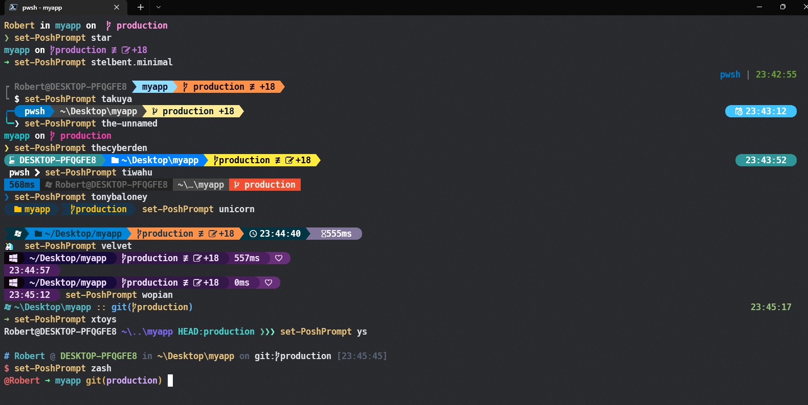

# Make the current commit the only (initial) commit in a Git repository

**Description :**   Deleting the .git folder may cause problems in your git repository. If you want to delete all your commit history but keep the code in its current state, it is very safe to do it as in the following:

**Example** :

```powershell
iwr -useb get.scoop.sh | iex
git config --global credential.helper manager-core
scoop install sudo
scoop install windows-terminal
scoop install extras/vcredist2022
scoop install starship
scoop install fzf
scoop install nuget
iex "& { $(irm https://aka.ms/install-powershell.ps1) } -UseMSI"
install-Module posh-git  -Scope CurrentUser -Force
install-Module oh-my-posh -Scope CurrentUser -Force
sudo Install-Module -Name Terminal-Icons -Repository PSGallery -Force
sudo Install-Module -Name z -Force -AllowClobber
Install-Module -Name PowerShellGet -Force
sudo Install-Module -Name PSReadLine -AllowPrerelease -Scope CurrentUser -Force  -SkipPublisherCheck
Set-PSReadLineOption -PredictionSource History
Set-PSReadLineOption -PredictionViewStyle listView
Install-Module -Name PSFzf -Scope CurrentUser -Force

```


**this will not keep your old commit history around**


**[based on a mix of answers in stackoverflow](https://stackoverflow.com/questions/9683279/make-the-current-commit-the-only-initial-commit-in-a-git-repository)**


  


cd ~\AppData\Local
git clone https://github.com/JanDeDobbeleer/oh-my-posh.git




