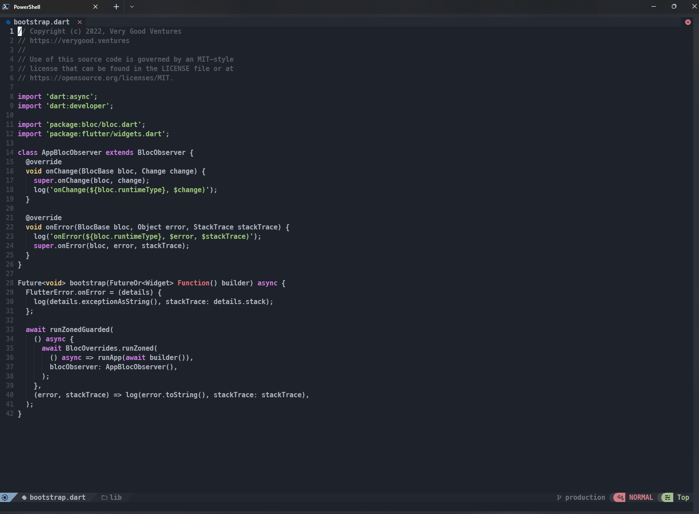
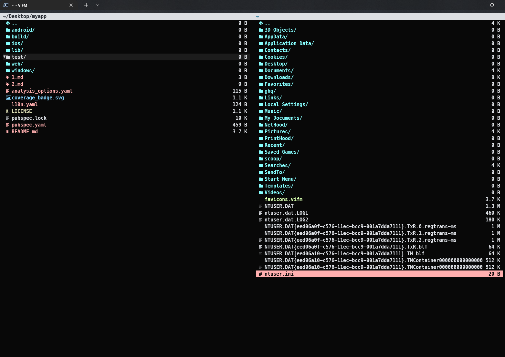

# Neovim in Windows 10

**Description :**

**Example** :

```powershell
# install neovim and tools needed
scoop install neovim
scoop install gcc
scoop install mingw

# Neovim GUI <optional>
scoop install goneovim
scoop install neovim-qt
scoop install fvim

# install NVChad
git clone https://github.com/wbthomason/packer.nvim $env:LOCALAPPDATA\nvim-data\site\pack\packer\start\packer.nvim
git clone https://github.com/wbthomason/packer.nvim "$env:LOCALAPPDATA\nvim-data\site\pack\packer\start\packer.nvim"
git clone https://github.com/NvChad/NvChad nvim --depth 1
#Copy the nvim dir to ~/AppData/Local/ and then
nvim +'hi NormalFloat guibg=#1e222a' +PackerSync

# install VIFM
scoop install vifm

# remember to copy this folders in order to get favicom icons in vifm
# .config
# .vifm
# favicons.vifm
```


**Now lets change some settings**

  



**showcase**


