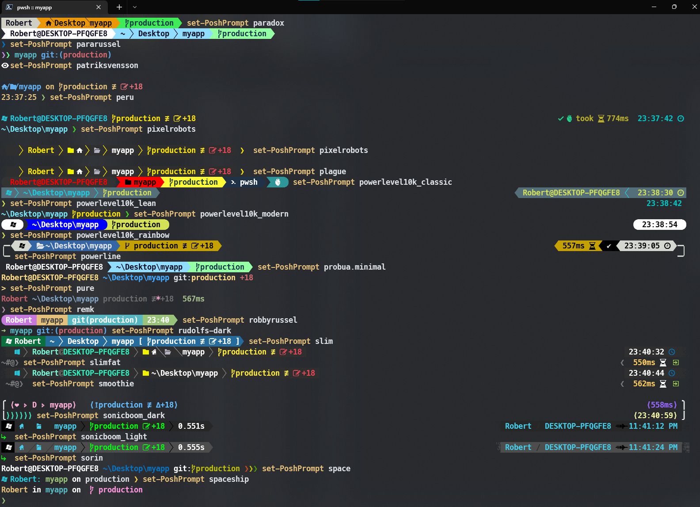

# Neovim in Windows 10

**Description :**

**Example** :

```powershell
# install neovim and tools needed
scoop install neovim
scoop install gcc
scoop install mingw

# Neovim GUI <optional>
scoop install goneovim
scoop install neovim-qt
scoop install fvim

# install NVChad
git clone https://github.com/wbthomason/packer.nvim $env:LOCALAPPDATA\nvim-data\site\pack\packer\start\packer.nvim
git clone https://github.com/wbthomason/packer.nvim "$env:LOCALAPPDATA\nvim-data\site\pack\packer\start\packer.nvim"
git clone https://github.com/NvChad/NvChad nvim --depth 1
#Copy the nvim dir to ~/AppData/Local/ and then
nvim +'hi NormalFloat guibg=#1e222a' +PackerSync

# install VIFM
scoop install vifm


```


**Now lets change some settings**


**utility command - `ctrl + r`**

**utility command - `ctrl + b`**

 **utility command - `which`**


**showcase**





**how to set a theme**
```powershell
set-PoshPrompt M365Princess
set-PoshPrompt agnoster
set-PoshPrompt agnosterplus
set-PoshPrompt aliens
set-PoshPrompt amro
set-PoshPrompt atomic
set-PoshPrompt atomicBit
set-PoshPrompt avit
set-PoshPrompt blue-owl
set-PoshPrompt blueish
set-PoshPrompt bubbles
set-PoshPrompt bubblesextra
set-PoshPrompt bubblesline
set-PoshPrompt capr4n
set-PoshPrompt cert
set-PoshPrompt cinnamon
set-PoshPrompt clean-detailed
set-PoshPrompt cloud-native-azure
set-PoshPrompt craver
set-PoshPrompt darkblood
set-PoshPrompt default
set-PoshPrompt di4am0nd
set-PoshPrompt dracula
set-PoshPrompt emodipt
set-PoshPrompt festivetech
set-PoshPrompt fish
set-PoshPrompt free-ukraine
set-PoshPrompt gmay
set-PoshPrompt grandpa-style
set-PoshPrompt half-life
set-PoshPrompt honukai
set-PoshPrompt hotstick.minimal
set-PoshPrompt hunk
set-PoshPrompt huvix
set-PoshPrompt if_tea
set-PoshPrompt iterm2
set-PoshPrompt jandedobbeleer
set-PoshPrompt jblab_2021
set-PoshPrompt jonnychipz
set-PoshPrompt jtracey93
set-PoshPrompt jv_sitecorian
set-PoshPrompt kali
set-PoshPrompt lambda
set-PoshPrompt lambdageneration
set-PoshPrompt larserikfinholt
set-PoshPrompt M365Princess
set-PoshPrompt marcduiker
set-PoshPrompt markbull
set-PoshPrompt material
set-PoshPrompt microverse-power
set-PoshPrompt mojada
set-PoshPrompt montys
set-PoshPrompt mt
set-PoshPrompt negligible
set-PoshPrompt night-owl
set-PoshPrompt nordtron
set-PoshPrompt nu4a
set-PoshPrompt paradox
set-PoshPrompt pararussel
set-PoshPrompt patriksvensson
set-PoshPrompt peru
set-PoshPrompt pixelrobots
set-PoshPrompt plague
set-PoshPrompt powerlevel10k_classic
set-PoshPrompt powerlevel10k_lean
set-PoshPrompt powerlevel10k_modern
set-PoshPrompt powerlevel10k_rainbow
set-PoshPrompt powerline
set-PoshPrompt probua.minimal
set-PoshPrompt pure
set-PoshPrompt remk
set-PoshPrompt robbyrussel
set-PoshPrompt rudolfs-dark
set-PoshPrompt rudolfs-light
set-PoshPrompt schema.json
set-PoshPrompt slim
set-PoshPrompt slimfat
set-PoshPrompt smoothie
set-PoshPrompt sonicboom_dark
set-PoshPrompt sonicboom_light
set-PoshPrompt sorin
set-PoshPrompt space
set-PoshPrompt spaceship
set-PoshPrompt star
set-PoshPrompt stelbent.minimal
set-PoshPrompt takuya
set-PoshPrompt the-unnamed
set-PoshPrompt thecyberden
set-PoshPrompt tiwahu
set-PoshPrompt tonybaloney
set-PoshPrompt unicorn
set-PoshPrompt velvet
set-PoshPrompt wopian
set-PoshPrompt xtoys
set-PoshPrompt ys
set-PoshPrompt zash
```

